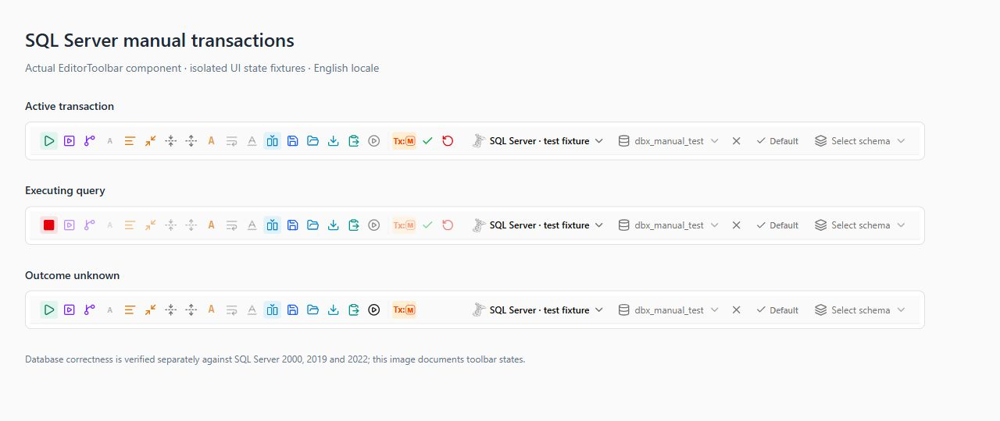

# SQL Server 手动事务（#7542）

实现基线：247eb2b0b（0.6.31），分支 codex/sqlserver-manual-transactions；2026-10-05 合并 upstream/main 38ce7b5dd（0.6.34）并重新做提交前验证。

桌面查询标签页使用独立专用连接。事务句柄、生命周期 generation、实际驱动诊断和结束原因仅保留在内存；自动提交连接的临时表与 SET 状态不继承。所有执行按 GO 分 batch，完整消费响应；结果行数限制只影响保留的行。同一事务串行，执行时提交/回滚返回 Busy。结束原因保留 5 分钟，定期清理，最多保留 1024 条。

原生路径采用普通 TDS batch 开启事务，检查 @@TRANCOUNT 与 XACT_STATE；SQL Server 2000（主版本 8.x 且 TDS 功能级别 7.1）缺少 XACT_STATE()，改用仅读取 @@TRANCOUNT 的旧版状态检查：无法区分可提交与不可提交事务，因此任何执行错误直接废弃所属会话，COMMIT/ROLLBACK 的确认响应仍是结束终局的唯一依据。SQL Server legacy 路由使用专用 Agent 进程。JDBC 采用 setAutoCommit(false)，在首次用户 batch 前确保一个物理事务，使用 JDBC commit/rollback；手动会话禁止自动重连。旧 legacy 组件缺少 manualTransactionBatch 能力时拒绝执行，需更新组件。没有服务器版本白名单。

执行失败尝试回滚；取消、超时、连接丢失和事务状态异常丢弃会话。只有明确回滚响应才能标记 rolled_back。提交确认立即记录 committed，连接清理不改变该结论。提交响应丢失记为 unknown，要求核对数据库，禁止重试提交和自动重跑 SQL。SQL Server 会话失效保留手动模式，仅下一次用户主动执行建立新事务。

## 按版本和实际驱动确认的范围

- SQL Server 2019 Developer 15.0.4490.9、2022 Developer 16.0.4295.3：原生 Tiberius、Microsoft JDBC 13.2、jTDS 1.3.1 的手动事务均有实库验收。
- SQL Server 2000：已在 MSDE SP4 Desktop Engine 8.00.2039 实例上验证原生 Tiberius 与 legacy Agent 的 jTDS 1.3.1 两条路径。显式选择 jTDS 与 legacy Agent 内 Microsoft JDBC 尝试后回退到 jTDS 均有覆盖；回退后实际驱动仍是 jTDS，不能标为 Microsoft JDBC 通过。
- 原生路径对 SQL Server 2000 的支持方式：2026-10-04 在上述真实 8.00.2039 实例上只读执行 SELECT XACT_STATE()，服务器返回 SQLState 42000 / vendorCode 195（不识别函数），探测前后 @@TRANCOUNT=0。该证据促成旧版状态检查分支而非排除支持：客户端用 SERVERPROPERTY('ProductVersion') 取得主版本，8.x（该服务器经本驱动协商出的 TDS 功能级别即为 SqlServer2000/2000Sp1）时状态探测只读 @@TRANCOUNT。主版本探测失败直接报错，不猜测服务器能力；错误码 195 且明确指向 XACT_STATE 的服务器错误仍归类为 Unsupported；认证、权限、网络和超时保留原有错误分类，开启失败不会执行用户 SQL。8.x 实库另要求并已修复 tiberius 登录响应解码（invalid token type 0）、TDS 7.1 功能级别协商、旧版 RPC ntext/image 编码与 ATTENTION 取消信号。
- 原生 TDS 不会因为手动事务开启失败自动切换为 JDBC；需要 JDBC 兼容路径时用户须显式选择 legacy 兼容驱动。其他未实测服务器版本不列为已验证；运行时仍按实际驱动与开启/状态探测结果判断，没有单一服务器版本白名单。
- 用户反馈本次客户端手工测试未发现问题；未记录的具体版本/实际驱动组合不据此增加到实库矩阵。

## 验证入口

- Rust：dbx-core::query::sqlserver_manual_transaction 协议故障测试；dbx-driver-sqlserver 事务控制词法测试；已有 PostgreSQL/MySQL/Agent 手动事务测试。
- Agent：common 的 JdbcExecutorTest，以及 sqlserver-legacy 的 SqlServerLegacyAgentTest；构建 sqlserver-legacy:shadowJar。
- 前端：queryStore.manualTransactionExpiry、queryStore.defaultTransactionMode、databaseFeatureSupport、EditorToolbar.transactionMode；vue-tsc 与 Vite 构建。
- 真实数据库：crates/dbx-core/tests/live_sqlserver_manual_transactions.rs（默认 ignored）。需要 DBX_TEST_SQLSERVER_HOST、PASSWORD、DATABASE、EXPECT_DRIVER，可选 USER、PORT、DRIVER_PROFILE。DATABASE 必须是可写的专用测试库。

legacy 实库测试使用 DRIVER_PROFILE=sqlserver-legacy，同时提供 DBX_TEST_SQLSERVER_AGENT_JAR、DBX_TEST_SQLSERVER_JAVA、DBX_TEST_SQLSERVER_JDBC_CLASS、DBX_TEST_SQLSERVER_JDBC_URL。测试向临时 Agent 目录导入此次 shadowJar，并使用指定 Java；不会覆盖用户安装的组件。EXPECT_DRIVER 必須非空并匹配服务器返回的实际驱动名，防止强制路径静默变成另一驱动。

2019/2022 的观察连接使用独立原生 TDS 连接及有界锁等待。SQL Server 2000 使用 DBX_TEST_SQLSERVER_COMPAT_2000=1，观察连接为独立、自动提交的 JDBC Agent 进程；旧版使用 master.dbo.sysprocesses 检查 WAITFOR 和会话释放，适配 DECLARE/SET、INSERT 及锁提示语法。锁验证必须取得明确的 lock request timeout，不能把语法错误当成隔离性成功。

## 2026-10-03 远端实库验收

通过 remote-shell MCP 连接 aliyun，使用服务器既有 Docker。数据库端口仅绑定远端 127.0.0.1:17542，本地测试经 MCP SSH 转发访问；本地没有启动 Docker。两个版本顺序运行，容器内存上限 2 GiB、MSSQL_MEMORY_LIMIT_MB=1536、CPU 上限 1.5。远端既有 campus 容器保持运行。

测试数据库均为 dbx_manual_test，服务器使用 Developer Edition。固定镜像摘要用于复现，不以 mutable 的 latest 标签标记验证版本：

- SQL Server 2022：16.0.4295.3，CU27；容器 dbx-sqlserver-7542-2022；镜像 mcr.microsoft.com/mssql/server@sha256:4402d880dd4c34bfa7d8705e56a86cd6c88da80a1f6bbbe741f999e76264a090。
- SQL Server 2019：15.0.4490.9，CU32；容器 dbx-sqlserver-7542-2019；镜像 mcr.microsoft.com/mssql/server@sha256:ef0b8db33970ecd01bed49c3a84a1d083c435a9891718df619298b67b352e74a。

首轮每个版本分别强制以下路径，7 项基础用例在六种组合中全部通过，共 42 次用例执行：

- 原生 TDS：实际驱动 tiberius (native TDS)，EXPECT_DRIVER=tiberius。
- Microsoft JDBC：实际驱动 Microsoft JDBC Driver 13.2 for SQL Server，13.2.0.0，EXPECT_DRIVER=Microsoft；显式配置 sslProtocol=TLSv1.2。
- jTDS：实际驱动 jTDS Type 4 JDBC Driver for MS SQL Server and Sybase，1.3.1，EXPECT_DRIVER=jTDS；显式 jTDS URL 使用 ssl=off，传输由 SSH 隧道保护。

七项真实用例覆盖：

1. 两个标签页独立 SPID，同一事务固定 SPID；提交可见性、回滚恢复、临时表跨执行复用、GO/变量/TRY CATCH、多结果集与截断后的后续结果消费。
2. WAITFOR 执行超时后丢弃会话，旧 ID 不再执行 SQL，结果报告 unknown。
3. SQL 执行错误及空闲到期后取得回滚确认，结果报告 rolled_back；空闲测试注入 last_activity=301 秒前，验证实际回滚路径，不等同于五分钟墙钟计时器验收。
4. 独立观察连接 KILL 被测 SPID，后续执行报告 unknown 并丢弃会话，旧 ID 不再执行 SQL。
5. 先从 sys.dm_exec_requests 确认 WAITFOR 已到达服务器，再取消；执行时提交和回滚均返回 busy；取消确认 terminal，后台请求与会话得到释放。
6. 用户 COMMIT、BEGIN TRANSACTION、USE、SET IMPLICIT_TRANSACTIONS 被拒绝且保持原事务；调用实际存储过程执行隐藏 COMMIT 后检测异常，结束会话并报告 unknown。
7. 在实际 WAITFOR 期间调用应用 remove_connection_pools，确认先取消执行，再完成连接清理；会话及运行查询登记为空，服务器已无该 SPID 的执行请求。

基础及补验完成后两个实例均检查：测试表 0、测试存储过程 0、其他用户会话的活动事务 0，DBCC OPENTRAN 无活动事务。失败诊断过程遗留的 fixture 已按实际查询返回的准确名称清理。两个测试容器最终均停止；本轮 2022 在 45 秒停止宽限后以 137 退出，Docker State.OOMKilled=false，发生于全部验收和事务残留检查完成之后；2019 正常以 0 退出。镜像和停止的容器保留以便复验；远端既有 campus 容器持续运行。

六组完整日志保存在本地 target/sqlserver-7542-{native,microsoft,jtds}-{2019,2022}.log。可在已有 Rust 构建环境下执行：

```powershell
cargo test -p dbx-core --test live_sqlserver_manual_transactions --no-default-features --features sqlite-bundled,test-support -- --ignored --nocapture --test-threads=1
```

运行前设置上述环境变量，并先启动一个测试容器、建立 SSH 转发。测试使用 sa 执行专用库 fixture、DMV 检查及 KILL 自己创建的会话；不要指向业务库。

## 真实网络和清理故障补验

2026-10-03 补充 4 项故障测试，在 SQL Server 2019/2022 × 原生/Microsoft JDBC/jTDS 六种组合中全部通过，共 24 次执行。测试代理仅转发真实 TDS/TCP 字节，不解析或伪造 SQL 结果；TLS 路径保持密文，jTDS ssl=off 路径由 SSH 隧道保护远端传输；独立观察连接绕过代理核对数据。每次故障后检查旧会话不可再执行、事务登记为空、被测连接仅建立一次，禁止用重新提交来确认结果。

1. COMMIT 发出前精确开启响应截断：服务端收到请求并完成提交，代理丢弃响应后断开；观察连接确认数据已持久化，DBX 返回 transactionOutcome=unknown。
2. ROLLBACK 请求阶段截断响应：DBX 返回 unknown，观察连接确认待提交数据不存在。连接中断也可能触发服务端自动回滚，因此数据为零不能单独证明显式 ROLLBACK 已完成；此用例验证响应中断时不虚报回滚成功。
3. 执行中真实断网：先从 DMV 确认 WAITFOR 正在服务器执行，再关闭代理 TCP 连接；DBX 报 unknown、废弃会话，观察连接确认待提交数据消失，无重连或 SQL 重放。
4. 已确认提交后的结束故障：原生路径在收到 COMMIT 确认后断开 TCP，并确认本地 socket handles 已释放；JDBC 包装器先调用真实 Connection.close，再抛 SQLException。两者均保留 committed，观察连接确认数据已持久化。原生连接 Drop 没有可返回的关闭错误，此路径不能称为原生 close 返回失败测试。

SQL Server 现有 legacy 路由使用单进程 Agent，兼容层的断开 RPC 可先确认后异步执行 JDBC close。测试在第 4 项临时持有 AgentClient 的 Arc，直到真实 close 错误被观察，再释放并确认 TCP 句柄关闭；否则进程 fail-stop 可能先于故障回调结束 Java。此 guard 不持有客户端锁、不改变生产路由，也不代表共享 Agent runtime 验证。正式 SQL Server Agent jar 不包含故障包装器；包装器仅位于 test-support.jar，原生精确阶段 hook 仅在 Rust test-support feature 下编译。

故障测试需要额外设置 DBX_TEST_SQLSERVER_FAULT_DRIVER_JAR 为 agents/test-support/build/libs/test-support.jar。可分别用 fault_ 与 wall_clock_idle 过滤器运行新增用例。完整日志在本地 target/sqlserver-7542-{native,microsoft,jtds}-fault-{2019,2022}-final.log。

真实墙钟空闲验证：2019/2022 的三个实际驱动均在约 301.3～301.5 秒后由后台 watchdog 主动回滚，收到 rolled_back 确认，待提交数据为零、路由池为空。此测试只读取会话登记，不修改时间戳、不发送新执行请求；等待期间保留真实服务器连接。六次用例全部通过，日志位于本地 target/sqlserver-7542-{native,microsoft,jtds}-idle-{2019,2022}.log。基础 42 次 + 故障 24 次 + 墙钟空闲 6 次，共 72 次最终实库用例通过，覆盖 12 项测试 × 6 种版本/驱动组合；重复诊断运行不计入该总数。

## 2026-10-04 最终取消修复的现代版本回归

最终发送/取消代码在 SQL Server 2019、2022 × Microsoft JDBC、jTDS 四种组合中补跑了每条 11 项即时用例，共 44 次全部通过。保留此前六种组合均通过的真实墙钟空闲证据，不重复累计为新的独立验收项。原生路径没有受到此次 Agent 写入/取消增量影响；先前原生实库结果仍保留。

四份最终日志为 target/sqlserver-7542-{microsoft,jtds}-regression-{2019,2022}.log。2022 首次补跑因暂停后 SSH 本地转发缺失而在连接阶段失败；恢复转发后从头重跑，两条路径均通过。环境连接失败的日志单独保留，不计为通过。

两个现代版本的最后 DBCC OPENTRAN 均显示 No active open transactions，专用测试库没有遗留本任务测试对象。测试结束后停止本任务容器，关闭本任务辅助 shell 与 SSH 转发，服务器既有 campus 业务容器保持运行。2019 停止退出码为 0；2022 在 45 秒停止期限后退出码为 137、OOMKilled=false，停止前已确认无遗留事务，并非测试期间 OOM。最终默认 features Windows debug 构建完成（10 分 44 秒），产出 target/debug/dbx.exe；构建重写且无实质差异的 manifest/自动生成权限文件已还原，未生成发布安装包或安装应用。

## 2026-10-04 SQL Server 2000 服务器实库验收

遵照用户要求，旧版数据库安装和运行均在 aliyun 上完成；本机不运行本任务的数据库容器或虚拟机，仅作为 DBX/Java 测试客户端。远端没有可用 KVM，使用专用 QEMU TCG 客体（1 vCPU、512 MiB RAM、4 GiB 专用可增长系统盘）。客体为 Microsoft 官方 POSReady 2009 评估版，安装经 Microsoft 签名校验的 MSDE 2000 SP4。

实际服务器返回：Microsoft SQL Server 2000 Desktop Engine 8.00.2039，Windows NT 5.1 Build 2600 SP3。SQL 端口仅监听远端 127.0.0.1:17540，MCP SSH 转发至本机 5566；测试库为独立创建的 dbx_manual_test。实际 JDBC 驱动均为 jTDS Type 4 1.3.1。

完整验证结果：

- 显式指定 jTDS：12 passed、0 failed，包含四项真实故障注入。
- legacy 组件默认 JDBC 驱动选择/兼容回退：8 passed、0 failed，实际使用 jTDS；跳过要求显式故障包装驱动的四项，不能标为这条路径的故障测试通过。
- 两条路径的真实空闲 watchdog 分别在 301.465 秒和 301.395 秒后确认回滚，待提交数据消失，无请求重放。
- 补齐发送阶段取消/总超时后，最终实库客户端重新运行所有即时用例：jTDS 11 passed、回退 7 passed。已通过的两次墙钟空闲验证保留；诊断和重复回归不叠加为独立验收项数。
- 最后独立检查：DBCC OPENTRAN 显示 No active open transactions，专用测试库没有遗留本任务事务、测试表或存储过程。

日志位于本地 target/sqlserver-7542-jtds-2000-final.log、sqlserver-7542-fallback-2000-final-no-faults.log，以及对应 *-2000-write-final*.log。最终清理证据为 target/sqlserver-7542-sql2000-cleanup.log。

首轮旧版实库测试发现取消与主动断开后，原 Agent 进程直接退出，SQL Server 2000 的 WAITFOR 及未提交事务仍保留。诊断同时检查 SPID、login_time、cmd 和 open_tran，确认是同一个遗留查询，并非 SPID 复用。修复只对 SQL Server 的专用事务查询启用取消走廊：显式 v2/multi_session 握手下，向 __legacy__ 会话发送 cancel_session，保持 stdin 打开，并按两个请求 ID 等待原查询响应及取消响应；整个取消写入和等待最多五秒，随后始终释放进程、废弃连接。重复确认、无关响应和普通 JSON 日志不能代替查询结束。

初始 execute_query 写入同样使用可取消的阻塞工作任务；发送与读取共享一次期限。请求尚未完整发送时取消/超时，只能强制释放进程，不追加 RPC、不重放或复用会话；结果保持 unknown。完整请求已经发送时继续使用 JDBC 取消走廊。自动化覆盖两种响应顺序、只有确认而无查询结果、重复确认、JSON 日志、取消请求的满管道、大请求发送时取消/超时、非 opt-in 行为和慢速写入后的总期限。其他数据库及 shared runtime 保持原取消策略。

旧版客体环境与系统盘保留。再次启动仅使用服务器 /root/dbx-sqlserver-7542/sql2000/start-installed.py 从已有系统盘启动；不要复用安装/恢复介质启动脚本。

原生 Tiberius 路径在同一 8.00.2039 实例上的最终矩阵：12 passed、0 failed，含执行中止释放服务器事务用例，日志 target/sqlserver-7542-native-2000-cleanup-final.log；当时唯一按过滤器排除的真实墙钟空闲用例已于 2026-10-04 晚补跑通过：301.395 秒真实空闲后后台 watchdog 主动回滚并确认 rolled_back，待提交数据为零、无请求重放，日志 target/sqlserver-7542-native-2000-wallclock-idle-final.log。至此 SQL2000 原生 13 项实库用例全部通过。

## 2026-10-04 原生协议最终增量的现代版本回归

最终原生协议增量（ExecutionGuard 丢弃执行 future 时发送 ATTENTION、8.x 旧版状态检查、新增执行中止用例）完成后，原生路径对两个现代版本重跑全部 13 项实库用例：SQL Server 2022 16.0.4295.3 用时 310.66 秒、SQL Server 2019 15.0.4490.9 用时 309.42 秒，均 13 passed、0 failed；两版本的真实墙钟空闲分别在 301.3 秒与 301.267 秒后确认回滚、待提交数据为零。日志 target/sqlserver-7542-native-{2019,2022}-regression-final.log。最终检查两个实例 DBCC OPENTRAN 均 No active open transactions，专用测试库无遗留测试表或存储过程；测试容器已停止，镜像与容器保留复验。最终代码的 tiberius 协议单元测试 147 项全部通过（复跑确认）。

## 实库发现并修复的 TLS 配置问题

原 legacy Agent 无条件将显式 sslProtocol 覆盖为 TLSv1。使用相同 Java 21、Microsoft JDBC 13.2 和 TLS 放宽设置进行只读连接对照时，本次 2022 实例上 TLSv1 连接失败，TLSv1.2 成功；失败发生于连接阶段，尚未执行用户 SQL。

修复保留未配置时的 TLSv1 默认值，但尊重显式 JDBC URL 或 url_params 中的 sslProtocol，url_params 优先。支持驱动接受的 TLS、TLSv1、TLSv1.1、TLSv1.2、TLSv1.3 规范值；大小写归一化，非法值明确失败，不静默降级。JDBC brace 转义、内部 ;/& 和 }} 使用同一属性拆分逻辑，避免将转义值内的协议文本当作外部设置。失败诊断包含实际配置的协议。

没有降低测试服务器的 TLS 策略。TLSv1.2 实库连接及事务矩阵已通过；TLSv1.3 参数解析经过单元测试，不代表本次实例完成 TLSv1.3 握手验证。

## 自动化验证结果

- Rust 核心手动事务回归：33 passed（包含 SQL Server 协议故障用例和既有 Agent/SQL 文件事务回归）。
- Rust dbx-driver-agent 最终回归：330 passed；另一个慢速请求写入的总期限集成测试 1 passed。新取消边界测试共 10 项。dbx-driver-sqlserver：142 passed、4 个已有实库用例 ignored。
- Rust dbx-core 与桌面 dbx：裁剪功能 cargo check 通过；补验默认 features 的 pnpm exec tauri build --debug --no-bundle --ci 通过，产出 target/debug/dbx.exe。复用已通过 Vite 构建的前端 dist；未生成或安装发布安装包。
- Java common:test 与 sqlserver-legacy:test：通过；sqlserver-legacy:shadowJar 构建通过。JdbcExecutorTest 25 项、SqlServerLegacyAgentTest 最终 37 项。
- 前端事务/能力/工具栏回归：5 个文件、108 passed。事务结果字段解析及文案回归：2 个文件、553 passed（两组包含重复的错误解析用例，不能相加作为独立测试总数）。
- vue-tsc --noEmit 与前端 Vite 构建：通过。
- 2026-10-04 时实库测试共 13 项：2019/2022 × 三个实际驱动的初次完整矩阵 72 次通过；最终 Agent 增量另补验现代 JDBC 四种组合的 44 次即时用例，通过。SQL2000 legacy 两条适用路径的完整 20 次及最终即时 18 次通过；SQL2000 原生 13 项全部通过（12 项即时矩阵 + 真实墙钟空闲）。最终原生协议增量后，2019/2022 原生各重跑 13 项全部通过。重复回归不合并成独立测试数量。正常 CI 默认 ignored，必须显式指向可写隔离测试库。
- 2026-10-04 的以上验证记录针对当时的代码；2026-10-05 提交前复核另外发现并修复请求丢弃与断开连接交叉的取消所有权问题，以及 JDBC 请求丢弃后过早结束取消走廊的问题。修复后检查结果单独记录。pnpm check 的 connection-types 与 packages/app-tests 发布签名用例在本机失败，与本次改动无关：connection-types 因 node_modules/.bin/node.CMD 启动失败，macOS 签名流程测试在基线 247eb2b0b 纯净检出同样 35/39 失败（Windows 环境缺少 macOS 签名工具链 mock 前置条件）。

Windows 的默认 GNU Rust 工具链缺少本地 C/OpenSSL 编译依赖，本次使用 target 下的便携编译依赖完成检查与测试，没有修改仓库 Cargo 配置或全局工具链。

## 尚未覆盖及发布要求

SQL Server 2000 的实际验证范围为 MSDE 2000 SP4 Desktop Engine 8.00.2039 + 原生 Tiberius 与 jTDS 1.3.1；未验证 SQL Server 2000 Enterprise/Developer Edition 与其他 Service Pack，也不能声称 Microsoft JDBC 13.2 支持 SQL Server 2000（legacy 路径回退后实际驱动为 jTDS）。默认 features 的 Windows debug 应用已构建，发布安装包生成与安装仍未验证。

范围不包括 Web 手动事务、嵌套事务、保存点或备份一致性快照。无法从事务计数检测到的存储过程自行提交并重新开启事务，不应被视为受 DBX 完全控制；可检测到的结束/计数异常会废弃会话。

legacy 发布时必须同时发布此次构建的 SQL Server Agent 组件，并按组件仓库流程更新可下载安装的版本；仅更新桌面应用而保留旧 Agent 会得到明确的组件更新提示。manualTransactionBatch 是运行时握手能力标识，不根据安装版本号猜测安全性。本次没有发布可下载组件；合并发布时需按组件仓库流程同步交付。

## 2026-10-05 提交前复核与上游合并

合并 upstream/main 38ce7b5dd（0.6.34）。JsonRpcServer 保留新增 deferLobs 选项以及 SQL Server returnAllResults 路由；queryStore 保留 SQL Server executionId/timeout 参数，兼容上游 useLargeValuePreview。新增 18 个文案键已覆盖 en、zh-CN、zh-TW、es、it、ja、ko、pt-BR、ru。

复核发现两个中断清理竞态并完成修复：disconnect 已移除 busy 会话时，后续执行 future 被丢弃，原 ExecutionGuard 无法取得清理所有权，disconnect 又只关闭 TCP，遗漏原生 ATTENTION；现在接管 busy 会话的 disconnect 同样负责有界中断。JDBC 执行 future 被丢弃时，直接追加 cancel_session 会因为原 reader 持有 stdout 而立即失败，随后过早关闭进程；现在每个 Agent batch 在持有客户端 Arc/锁的 owned task 内执行，外层 Drop 只取消 token，后台继续完成现有有界取消走廊。后台同时持有查询登记，直到取消结束才确认 terminal；正常 GO batch 完成后解除 Drop 取消 guard，不取消后续 batch。

修复前 SQL2000 真实 jTDS 的 aborted_request 用例失败，原服务器任务/事务未能及时释放；延迟取消响应的协议测试同样失败。修复后增加确定性的 disconnect 先取得会话所有权、随后 abort 请求的用例。协议测试不通过额外连接 Arc 保活，验证取消完成前登记仍活动、完成后释放；实库按 SPID + login_time 检查原服务器事务释放、未提交数据消失，且失效会话不会再次执行 SQL。

本次最终验证结果：

- Rust 核心手动事务相关回归 35 passed；Agent 339 passed、1 个原有外部制品测试 ignored；发送总期限集成测试 1 passed；SQL Server 驱动 145 passed、4 个原有实库测试 ignored。
- Java common 232 passed、sqlserver-legacy 37 passed，两个组件及故障测试 JAR 构建通过。
- 前端相关 5 文件 111 passed；vue-tsc 使用与上游 CI 相同的 8 GiB Node 堆配置通过；oxfmt、oxlint（无 error）、连接类型生成校验和 i18n dry-run 全部通过；Vite 生产构建通过。
- cargo fmt --check、git diff --check 通过。cargo check -p dbx --no-default-features --features sqlite-bundled 通过，包含桌面命令接口；不将单包检查标为整个工作区 make cargo-check-fast 通过。
- SQL2000 8.00.2039 的原生、jTDS 各 13 项即时实库用例通过；2019 15.0.4490.9 与 2022 16.0.4295.3 的原生、Microsoft JDBC 13.2、jTDS 各 13 项即时实库用例通过。上述每组排除且仅排除真实 5 分钟墙钟空闲测试；此前 2026-10-04 的真实墙钟结果保留，本次没有把这些历史结果标为重新执行。
- 最新实库测试集共 14 项（增加 disconnect + abort 交叉用例）。日志为 target/sqlserver-7542-pr-{2000,2019,2022}-{native,jtds,microsoft}-green.log 的适用组合；重复增量结果不累加为独立用例总数。
- 复核没有未解决的 P1/P2。三个测试实例均确认无遗留事务或测试对象；现代测试容器恢复停止状态。

本次未在最新上游合并后全量重跑 make check / pnpm check，不能标为全量检查通过；2026-10-04 的 Windows 签名测试基线结果见上文。当前安装包仍是此前构建的产物；本次桌面编译检查与前端构建不等同于重新产出安装包。上游 PR CI 结果需另行核对。

工具栏截图由真实 EditorToolbar 组件与隔离状态 fixture 渲染，展示活动、执行中、结果未知三个状态，不把组件截图当作实库证明：


